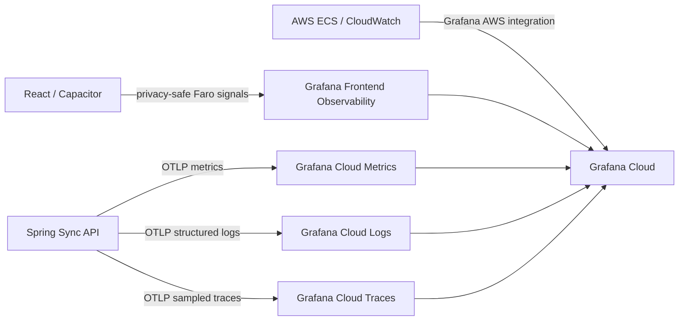

# Grafana Cloud observability

Grafana Cloud is the single monitoring and investigation surface for Loredays. No Grafana,
Prometheus, Loki, Tempo, or Alertmanager service is hosted on a developer machine.

## Signal path



Client requests retain one `X-Correlation-Id` across retries. The API returns that ID and records it
with the active trace and span IDs. Never add diary content, titles, tags, object paths, access tokens,
signed URLs, or raw account/device identifiers to a telemetry attribute.

The Faro client deliberately disables automatic instrumentations, page/browser metadata, persistent
sessions, and geolocation. Only names and attributes allowlisted by `Telemetry.ts` and the sanitized
error type are sent. The collector still needs exact CORS origins and an appropriate retention policy.

## One-time Grafana Cloud setup

1. In the Grafana Cloud stack, open **Connections > OpenTelemetry > Configure**. Generate an access
   policy token with only metrics, logs, and traces write scopes. Copy the values of
   `OTEL_EXPORTER_OTLP_ENDPOINT` and the `Authorization` header. Do not commit either credential.
2. Open **Observability > Frontend**, create `dear-diary-web-staging`, and allow exactly
   `https://staging.d33b4rjnv35mrn.amplifyapp.com` and `https://localhost` (Android WebView). Grafana
   Cloud accepts only HTTP(S) origins, so the default iOS `capacitor://localhost` origin requires a
   separately authenticated HTTPS telemetry proxy before it can be enabled. Copy the collector URL.
   Create a separate production application and exact production web origin before production rollout.
3. Store the backend values in AWS Systems Manager Parameter Store and the public Faro collector URL in
   the Amplify branch configuration:

   ```powershell
   powershell -ExecutionPolicy Bypass -File scripts/configure-grafana-cloud.ps1
   ```

   The script prompts securely for the authorization value, writes
   `/dear-diary/staging/grafana-otlp-endpoint` and
   `/dear-diary/staging/grafana-otlp-authorization` as `SecureString` parameters, preserves the existing
   Amplify branch variables, and adds `VITE_GRAFANA_FARO_URL`.

4. Confirm `DearDiaryEcsTaskExecutionRole` can call `ssm:GetParameters` and `kms:Decrypt` for those two
   parameters. The task definition injects them only at runtime.
5. Import the JSON dashboards from `ops/grafana/dashboards`. Each dashboard prompts for the Grafana
   Cloud Metrics data source; the overview also prompts for Logs and Traces, while **Loredays Logs &
   Errors** prompts only for Logs.
6. Import `ops/prometheus/alerts.yml` into Grafana Cloud Metrics alerting, select a notification contact
   point, and run a synthetic staging failure before enabling paging.
7. In **Connections > AWS**, connect AWS account `908027418886` in `ap-south-1` and enable ECS,
   Application/Network Load Balancer, S3, RDS/PostgreSQL, and CloudWatch Logs integrations. This adds
   infrastructure and AWS service health to the same Grafana stack.

The AWS IDs in this repository are deployment identifiers, not credentials. Access policy tokens,
notification destinations, and Grafana service-account tokens always stay in Grafana or AWS secret
storage.

## Deploy and verify

Redeploy both staging components after the one-time setup. The ECS task enables OTLP logs, metrics, and
10% sampled traces; the Amplify build embeds only the CORS-restricted Faro collector URL.

Verify the data path in this order:

1. In Grafana Explore (Metrics), query
   `process_uptime_seconds{job="dear-diary/dear-diary-sync-api",deployment_environment="staging"}`.
2. Send a safe correlation ID to staging and find it in Explore (Logs):

   ```powershell
   Invoke-WebRequest `
     https://de-95a19ada9bcf4598832bc6673d977727.ecs.ap-south-1.on.aws/actuator/health `
     -Headers @{ 'X-Correlation-Id' = 'grafana-cloud-smoke-1234' }
   ```

   Query `{service_name="dear-diary-sync-api"} |= "grafana-cloud-smoke-1234"` and open the trace ID.

3. In Explore (Traces), query `{ resource.service.name = "dear-diary-sync-api" }`.
4. Open **Observability > Frontend**, load the staging web app, perform a sync, and confirm the
   `dear-diary-client` application receives a new session and measurement.
5. Open **Infrastructure > AWS > ECS** and confirm the staging service and task appear.

If the backend task will not start, check that both SSM parameters exist and that the ECS execution role
can decrypt them. A healthy task with no signals usually means an endpoint/header was copied partially;
copy both values again from the OpenTelemetry connection tile. Faro `401`/`403` responses normally mean
the collector URL or exact allowed origin is wrong.

## Service objectives

| Concern                  | Initial objective                                      | Alerting approach                    |
| ------------------------ | ------------------------------------------------------ | ------------------------------------ |
| Sync commit availability | 99.9% successful commits over 30 days                  | Multi-window burn-rate page          |
| Sync commit latency      | 99% under 2 seconds                                    | Ticket on sustained p95 regression   |
| Integrity                | Zero hash, sequence, invariant, or corruption failures | Page immediately                     |
| Notification freshness   | 99% published within 15 minutes                        | Warn on age/depth, page if sustained |
| Client stability         | At least 99.8% crash-free sessions                     | Release/version scoped warning       |

Treat the checked-in rules as a starting point. Tune them from measured staging baselines and verify
every notification includes a dashboard link, owner, severity, and runbook before paging is enabled.
