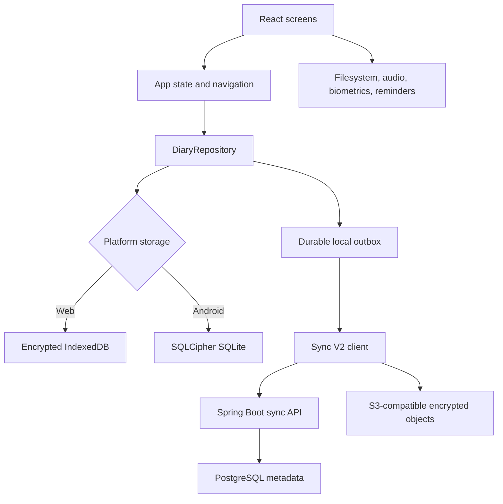

# Dear Diary

Dear Diary is a private, local-first journaling application for Android and linked web companions. Android is the primary standalone target. A browser without a local sync account opens the companion-link flow and must be approved from a primary Android device.

Journal plaintext stays on trusted devices. The current Sync V2 path encrypts payloads on the client, uses Supabase Auth for identity, stores synchronization metadata in the Spring Boot sync service and PostgreSQL, and stores encrypted objects in an S3-compatible object store.

## Features

- Multiple journals with custom covers, colors, icons, and optional session-level locks.
- Rich-text entries, timeline blocks, moods, tags, photos, audio notes, and dictation.
- Quick notes with pinning, tags, rich text, and conversion to journal entries.
- Search, calendar and table-of-contents views, writing streaks, mood trends, tag usage, and a writing heatmap.
- A local PIN, recovery question, Android biometric unlock, automatic privacy locking, and diary-level access controls.
- Encrypted, local-first multi-device sync with durable outbox operations, companion pairing, recovery, key rotation, conflict preservation, and encrypted snapshots.
- Encrypted IndexedDB storage on the web and SQLCipher-backed SQLite plus app-private media files on Android.

The app includes portable backup and legacy sync utilities for compatibility and migration, but the current Settings UI centers on encrypted account sync rather than manual Drive backup scheduling or local import/export.

## Architecture



`src/App.tsx` owns navigation and application-level state; the project does not use a client router. The primary destinations are Today, Diaries, Notes, Insights, Search, and Settings.

All journal mutations go through the asynchronous `DiaryRepository`. A synced write updates encrypted local storage and its durable outbox record before returning to the UI. Network upload, remote pull, acknowledgement, snapshots, and archive hydration run afterward. Repository change events and targeted queries keep screens current without reloading the entire data set after normal navigation.

The Express host is intentionally small. In development it mounts Vite middleware; in production it serves `dist` with an SPA fallback. `GET /api/health` is the only application API on that host. The separate Spring Boot service under `backend/sync-api` owns Sync V2 endpoints.

For details, see:

- [Sync architecture and compatibility](docs/sync-and-supabase.md)
- [Local Sync V2 environment](docs/local-sync-v2.md)
- [Android and Capacitor](docs/mobile-capacitor.md)
- [Performance measurement](docs/performance.md)
- [Production sync operations](docs/production-operations.md)
- [Testing](docs/testing.md)

## Local development

### Prerequisites

- Node.js and npm compatible with the checked-in lockfile.
- A modern browser.
- Docker for Supabase integration tests and the complete local Sync V2 stack.
- Java 21 for the Sync V2 backend.
- Android Studio and a compatible JDK for Android builds and checks.

Install dependencies and start the web host:

```bash
npm ci
npm run dev
```

Open `http://localhost:3000`. On Windows systems that block `npm.ps1`, use `npm.cmd` and `npx.cmd`.

To start PostgreSQL, MinIO, the Sync V2 backend, and the web host together on Windows:

```powershell
powershell -ExecutionPolicy Bypass -File scripts/start-local-sync-v2.ps1
```

See [docs/local-sync-v2.md](docs/local-sync-v2.md) for endpoints, emulator networking, and reset commands.

## Common commands

| Command                      | Purpose                                                                        |
| ---------------------------- | ------------------------------------------------------------------------------ |
| `npm run dev`                | Start Express with Vite middleware.                                            |
| `npm run format`             | Format supported source, configuration, and documentation files with Prettier. |
| `npm run format:check`       | Verify formatting without changing files.                                      |
| `npm run lint`               | Run TypeScript checks, including unused locals and parameters.                 |
| `npm run test:unit`          | Run the core TypeScript unit suites.                                           |
| `npm run test:component`     | Run Vitest component tests.                                                    |
| `npm run test:server`        | Run Express host tests.                                                        |
| `npm run backend:test`       | Run the Spring Boot backend test suite.                                        |
| `npm run test:supabase`      | Run Docker-backed compatibility migrations and RPC tests.                      |
| `npm run test:e2e`           | Run Playwright end-to-end tests.                                               |
| `npm run test:accessibility` | Run the accessibility-tagged Playwright checks.                                |
| `npm run test:ops`           | Validate dashboards and alert configuration.                                   |
| `npm run scan:secrets`       | Check for secrets and generated artifacts.                                     |
| `npm run build`              | Build the web client and bundled Express host.                                 |

The all-in-one `npm run test:all` command also requires Docker, Playwright browsers, and the Android toolchain. Use the focused commands while developing and the complete command in a fully provisioned release environment.

## Android development

The Android project is checked in; a normal checkout should not run `cap add android`.

```bash
npm ci
npm run mobile:sync
npm run android:studio
```

Useful Android checks and release tasks:

```bash
npm run android:test
npm run android:lint
npm run android:release
npm run android:bundle
```

Native WebView inspection is disabled by default. For a local debug build only, set `CAPACITOR_WEBVIEW_DEBUG=true` before running `npm run mobile:sync`.

## Configuration

Copy `.env.example` to `.env` and fill only the services needed for the workflow being run. Vite exposes only variables prefixed with `VITE_` to browser code.

The main client settings are:

- `VITE_GOOGLE_WEB_CLIENT_ID` for Google identity and legacy Drive compatibility flows.
- `VITE_SUPABASE_URL` and `VITE_SUPABASE_ANON_KEY` for Supabase Auth and the V1 compatibility control plane.
- `VITE_SYNC_V2_API_URL` for the Spring Boot Sync V2 service.
- `VITE_TELEMETRY_ENDPOINT` and `VITE_CRASH_REPORT_ENDPOINT` for optional privacy-safe reporting.

Backend database, JWT, object-store, notification, garbage-collection, tracing, and CORS settings are documented inline in [.env.example](.env.example). Production release builds validate required configuration and fail closed when it is incomplete.

Never commit `.env`; the repository ignores `.env*` except `.env.example`.

## Storage and security

| Concern                      | Web companion                                | Android                                     |
| ---------------------------- | -------------------------------------------- | ------------------------------------------- |
| Journal and settings records | Encrypted IndexedDB                          | SQLCipher-backed SQLite                     |
| Photos, covers, and audio    | Encrypted browser records or data references | App-private Capacitor files                 |
| Database secret              | Browser-origin storage boundary              | Random key held in OS-backed secure storage |
| UI-only display preference   | `localStorage`                               | Preferences mirrored into `localStorage`    |

Rich text is sanitized before persistence, import, replay, editing, and display. PINs are stored as salted SHA-256 hashes. Recovery answers are normalized, salted, and derived with PBKDF2. Sync object hashes are verified before decryption and application.

Clearing browser site data or Android app storage removes local journal data and local security material. Recovery then depends on a valid encrypted sync account or another trusted device. Android OS backup and device transfer are disabled to avoid restoring an encrypted database without its key.

## Project structure

| Path               | Responsibility                                                                |
| ------------------ | ----------------------------------------------------------------------------- |
| `src/components`   | Screens and reusable UI.                                                      |
| `src/domain`       | Pure application and security rules.                                          |
| `src/repositories` | Local-first repository abstraction and implementations.                       |
| `src/platform`     | Storage, security, filesystem, audio, and platform adapters.                  |
| `src/mobile`       | Capacitor bootstrap, native media, reminders, and deep links.                 |
| `src/sync`         | Encryption, V1 compatibility, outbox, recovery, and Sync V2 client logic.     |
| `backend/sync-api` | Spring Boot Sync V2 API and Flyway migrations.                                |
| `android`          | Native Android shell and Drive bridge.                                        |
| `tests/e2e`        | Playwright application and accessibility tests.                               |
| `docs`             | Maintained architecture, operations, mobile, performance, and testing guides. |
| `ops`              | Prometheus alerts and Grafana dashboards.                                     |

## Release limitations

- iOS dependencies and scripts are present, but an iOS native project is not checked in and must be generated and validated on macOS.
- Physical-device validation is still required for real OAuth and object-store environments, biometrics, permission prompts, background behavior, interrupted storage migration, low-storage handling, and production-signed Android builds.
- Legacy V1 sync and portable backup code remain until account migration and rollback requirements allow their removal.
