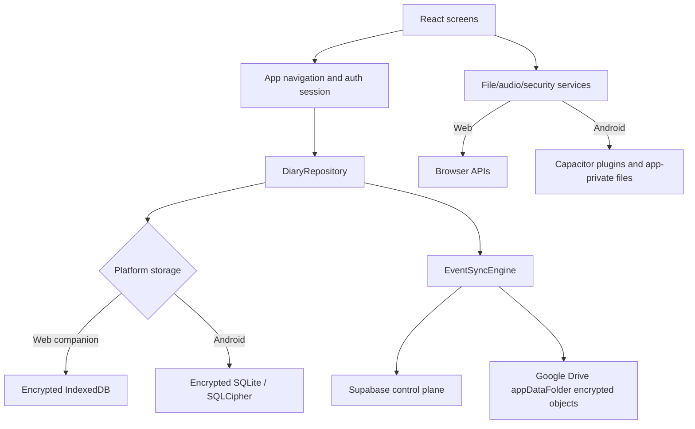

# Dear Diary

Dear Diary is a private journaling app for Android and linked web companions. It keeps readable journal content on trusted devices, uses a local PIN for day-to-day access, and can sync encrypted diary data across devices through Supabase metadata plus encrypted Google Drive `appDataFolder` objects.

Android is the primary standalone target. The web app currently opens as a companion-link surface when no encrypted sync account is stored locally; create or recover the primary account on Android first, then approve the browser from the primary device.

## Contents

- [Current Functionality](#current-functionality)
- [Core Flows](#core-flows)
- [Architecture](#architecture)
- [Storage and Privacy](#storage-and-privacy)
- [Encrypted Sync](#encrypted-sync)
- [Local Development](#local-development)
- [Android Development](#android-development)
- [Environment Variables](#environment-variables)
- [Testing](#testing)
- [Project Structure](#project-structure)
- [Known Limitations](#known-limitations)

## Current Functionality

### Journals and Entries

- Create multiple diaries with name, emoji, color, cover image, decorative icons, and optional diary lock.
- Create, edit, and delete dated entries with title, time, rich text, mood, tags, photos, and voice notes.
- Use single-entry writing or a timeline-style entry made from ordered time-stamped blocks.
- Format rich text with headings, emphasis, quotes, lists, and font controls.
- Use local reflection suggestions for mood, tags, and a short empathetic response. This is heuristic and local; journal text is not sent to an AI service.
- Record audio notes and dictate text when the platform microphone and speech services allow it.

### Reading, Search, and Reflections

- Browse entries newest-first with page navigation and swipe gestures.
- Open diary entries from table of contents or calendar views.
- Search entries and notes by title/body, source, tags, date range, and photo presence.
- Keep locked-diary content out of Home, Search, and Reflections until that diary is unlocked for the current app session.
- View streaks, entry counts, mood distribution, tag usage, 30-day writing heatmap, photo memories, and year/month mood calendars.
- Restore older encrypted archive months on demand from diary calendar/search flows when a linked account has partitioned archive data that is not downloaded locally yet.

### Notes and Home

- Capture quick notes, pin them, tag them, edit them with rich text, and convert them into diary entries.
- Use the Home screen for greeting/profile context, daily word goal, writing streak, recent diaries, common tags, rotating prompts, and Quick Jot.

### Security and Settings

The Settings screen has four tabs:

| Tab | Current capabilities |
| --- | --- |
| Profile | Reconnect encrypted sync, approve pending web companions, revoke linked companions, and edit profile/avatar/daily target. |
| Security | Change the 4- or 8-digit app PIN, update the recovery question, inspect Google recovery identity, rotate the encrypted account recovery passphrase, and enable Android biometric unlock when available. |
| Backup | Inspect encrypted cloud storage usage, sync health, last cloud save time, recovery readiness, and reset local journal content while keeping local security/account configuration. |
| Customize | Configure Android reminder preference/time, switch light/dark theme, and manage custom tags and moods. |

The old Settings controls for manual Drive backup scheduling and "Back up now" are no longer exposed in the React UI. The active cloud path is encrypted multi-device sync. Portable backup bundle utilities remain in code and tests, but the current user-facing Settings screen does not provide a manual local export/import flow.

## Core Flows

### First Android Launch

1. The bootstrap layer opens local storage, migrates legacy native media when needed, starts media cleanup, and loads settings/security/profile/sync state.
2. The user creates a 4- or 8-digit app PIN.
3. A local recovery question is required.
4. The user signs in with Google and creates or recovers an encrypted account using a recovery passphrase.
5. New accounts upload a recovery key package and initial encrypted snapshot. Existing accounts use the recovery passphrase to recover the account root key and perform two-phase primary recovery.
6. After setup, the app opens locked and starts normal local-first operation with encrypted sync available.

### Web Companion Link

1. The browser asks the user to continue with the Google account already linked to the primary mobile account.
2. The browser creates a companion pairing request and displays an 8-digit code.
3. The primary mobile device approves the code in Settings > Profile > Companion Devices.
4. The browser receives an encrypted key package, restores the encrypted diary state, and then opens as a linked companion.

### Unlocking and Relocking

- Every app mount starts locked.
- Unlock uses the app PIN, or Android biometric unlock when enabled.
- The navigation-bar lock button ends the authenticated session and clears diary-level unlocks.
- On native app resume, Dear Diary locks after being in the background for the configured privacy interval, currently five minutes.

### Forgotten PIN

- The lock screen can reset the PIN with the local recovery answer.
- A linked Google account can also verify recovery identity when available.
- Resetting the PIN disables enrolled biometric/passkey state; it can be enrolled again from Settings.

### Locked Diaries

- A locked diary uses the same app PIN or enabled biometric identity.
- Unlock is session-local; relocking the app forgets unlocked diary IDs.
- Diary locks are application access controls. They do not create a separate encrypted database or a separate diary-specific PIN.

### Companion Revocation

Only the primary mobile device can revoke a linked companion. Revocation requires the recovery passphrase because the primary rotates the encrypted account key epoch, writes a new recovery package, distributes key packages to remaining active companions, and only then finalizes revocation. A local PIN or biometric check proves local presence, but it does not prove the user can preserve account recovery after the key rotation.

## Architecture



`App.tsx` owns in-memory navigation instead of React Router. Top-level tabs are Home, Diaries, Notes, Search, Reflections, and Settings. Nested screens include diary detail, diary settings, entry editor, app settings, and lock state.

All application writes go through the async `DiaryRepository`. Local writes are serialized to avoid overlapping update loss. When encrypted sync is configured, `syncingDiaryRepository` wraps repository mutations and commits encrypted domain events through `EventSyncEngine`.

The Express server is intentionally small:

- `npm run dev` starts Express with Vite middleware.
- Production serves the built `dist` directory with SPA fallback.
- `GET /api/health` returns `{ "status": "ok", "offline": true }`.
- There are no journal CRUD, auth, AI, or backup APIs on the server.

## Storage and Privacy

| Concern | Web companion | Android |
| --- | --- | --- |
| Journal/settings/security records | Encrypted IndexedDB | Encrypted SQLite / SQLCipher |
| Photos, covers, audio | Browser storage/data references | App-private files under Capacitor `Directory.Data` |
| SQLite secret | Not applicable | Random secret in OS-backed Capacitor Secure Storage |
| Legacy Preferences | Not applicable | Migration input only; SQLite is authoritative after migration |
| UI-only diary layout | `localStorage` | Mirrored through Preferences, then hydrated into `localStorage` |

PINs are stored as salted SHA-256 hashes. Recovery answers are normalized, salted, and stored with PBKDF2 using 120,000 iterations. Rich text is sanitized before persistence, import, sync replay, and display.

Clearing browser site data or Android app storage deletes local diary data and security material. Android clear storage or uninstall is destructive unless the encrypted account can be recovered from cloud sync or another trusted device.

## Encrypted Sync

Encrypted sync uses:

- Supabase for account/device metadata, cursors, object hashes, and Drive file pointers.
- Google Drive `appDataFolder` for encrypted events, media, thumbnails, snapshots, partition snapshots, manifests, and key packages.
- Client-side account root keys; plaintext journal data is not stored in Supabase or Google Drive by application code.

Important sync behavior:

- User writes are staged locally first, then uploaded as encrypted events and media.
- Drive object bytes are checked against Supabase SHA-256 metadata before decrypting/applying.
- Latest-first restore loads core data and recent months first, then marks older monthly partitions as available for on-demand hydration.
- Primary mobile recovery and companion revocation are two-phase flows so old devices are not revoked until restore/package distribution succeeds.
- See [docs/sync-and-supabase.md](docs/sync-and-supabase.md) for the operational runbook.

Google Drive integration uses the scope:

```text
https://www.googleapis.com/auth/drive.appdata
```

## Local Development

Prerequisites:

- Node.js and npm compatible with the checked-in lockfile.
- A modern browser.
- Docker only when running Supabase integration tests.
- Android Studio/JDK only when building or testing Android.

Install and run:

```bash
npm ci
npm run dev
```

Open `http://localhost:3000`.

Useful commands:

| Command | Purpose |
| --- | --- |
| `npm run dev` | Start Express with Vite middleware. |
| `npm run lint` | Run TypeScript checks with unused-code guardrails. |
| `npm run test:storage` | Run repository, domain, security, sync, and backup utility tests. |
| `npm run test:component` | Run Vitest component tests. |
| `npm run test:server` | Run Express server tests. |
| `npm run test:supabase` | Run Docker-backed Supabase/RPC integration tests. |
| `npm run test:e2e` | Run Playwright end-to-end tests. |
| `npm run scan:secrets` | Scan for committed secrets/generated artifacts. |
| `npm run build` | Build the Vite client and bundled Node server. |
| `npm run start` | Start `dist/server.cjs`; set `NODE_ENV=production` for static serving. |

## Android Development

The Android project is already present; do not run `cap add android` for a normal checkout.

Common workflow:

```bash
npm ci
npm run mobile:sync
npm run android:studio
```

Run on a connected target:

```bash
npm run android
```

Create a debug APK from PowerShell:

```powershell
npm run mobile:sync
Set-Location android
.\gradlew.bat assembleDebug
```

Native debug inspection is disabled by default. For local inspection only:

```powershell
$env:CAPACITOR_WEBVIEW_DEBUG='true'
npm run mobile:sync
```

Release helpers:

```bash
npm run assets:generate
npm run android:lint
npm run android:test
npm run android:release
npm run android:bundle
```

## Environment Variables

Copy `.env.example` to `.env` for Google/Supabase-backed sync. Vite only exposes `VITE_` variables to client code.

| Variable | Required for | Notes |
| --- | --- | --- |
| `VITE_GOOGLE_WEB_CLIENT_ID` | Google sign-in and Drive `appDataFolder` access | Use the OAuth Web application client ID, not the Android client ID. |
| `VITE_SUPABASE_URL` | Encrypted sync | Supabase project URL. Apply `docs/supabase/001` through `docs/supabase/017` first. |
| `VITE_SUPABASE_ANON_KEY` | Encrypted sync | Supabase anon key. |
| `VITE_ENABLE_MD_FLOW_HOOKS` | Manual MD-021/MD-022 force-stop testing only | Never enable in release builds. |
| `VITE_APP_VERSION` | Optional | Version recorded in backup/sync metadata where used. |
| `CAPACITOR_WEBVIEW_DEBUG` | Optional Android build-time setting | Enables Android WebView inspection when exactly `true`. |
| `CAPACITOR_BRIDGE_LOGGING` | Optional Android build-time setting | Enables verbose bridge logging; keep off for sync/recovery tests. |
| `CAPACITOR_DEBUG` | Optional legacy build-time setting | Also enables WebView inspection when exactly `true`; prefer `CAPACITOR_WEBVIEW_DEBUG`. |
| `DISABLE_HMR` | Optional development setting | Disables Vite HMR/file watching when exactly `true`. |
| `NODE_ENV` | Production server | Set to `production` when serving built assets through `npm run start`. |

Never commit `.env`; the repository ignores `.env*` files except `.env.example`.

## Testing

Recommended local validation:

```bash
npm run lint
npm run test:storage
npm run test:component
npm run test:server
npm run scan:secrets
npm run build
```

Additional suites:

- `npm run test:supabase` requires Docker and applies every SQL migration in `docs/supabase` in numeric order.
- `npm run test:e2e` and `npm run test:accessibility` require Playwright browser setup.
- `npm run android:test` and `npm run android:lint` require the Android toolchain.

The automated suite covers repository semantics, security hashing/recovery, rich-text sanitization, encrypted sync events, snapshots, partitioned restore, companion pairing, key rotation/revocation, media handling, backup utility validation, component behavior, and server API boundaries.

Physical-device QA remains necessary for Google consent, Android biometrics, microphone behavior, notification permission, SQLite/legacy-media migration, app background privacy lock, Android clear-storage recovery, and real multi-device sync conflict/recovery scenarios.

## Project Structure

```text
.
|-- src/
|   |-- AppBootstrap.tsx              # storage/migration startup gate and web companion routing
|   |-- App.tsx                       # auth session, navigation, lock state, sync resume
|   |-- components/                   # lock, home, diary, editor, notes, search, stats, settings
|   |-- domain/                       # security, catalog, rich-text, locks, merge/storage calculations
|   |-- repositories/                 # async repository, syncing wrapper, defaults
|   |-- sync/                         # encrypted sync, Supabase control plane, pairing, recovery, key rotation
|   |-- platform/
|   |   |-- storage/                  # encrypted IndexedDB, Preferences migration, encrypted SQLite
|   |   |-- filesystem/               # web/native file storage
|   |   |-- audio/                    # recording abstractions
|   |   |-- security/                 # native biometric / WebAuthn abstractions
|   |   `-- drive/                    # Capacitor bridge type for native Drive plugin
|   |-- mobile/                       # Capacitor bootstrap, reminders, media persistence/cleanup
|   `-- utils/                        # backup bundle utilities, Google auth/profile, WebAuthn helpers
|-- android/                          # Android Studio project and native Drive/biometric/storage integration
|-- docs/
|   |-- mobile-capacitor.md           # native implementation notes
|   |-- sync-and-supabase.md          # encrypted sync runbook
|   `-- supabase/                     # ordered SQL migrations 001-017
|-- server.ts                         # Express/Vite development and static production server
|-- vite.config.ts                    # Vite, React, Tailwind, alias, HMR config
|-- capacitor.config.ts               # Capacitor app/native settings
`-- package.json                      # scripts and dependencies
```

Important entry points:

- `src/main.tsx` renders React and starts Capacitor bootstrap behavior.
- `src/AppBootstrap.tsx` prevents the UI from opening before local state is usable.
- `src/repositories/localDiaryRepository.ts` owns local CRUD, snapshots, migrations, and reset behavior.
- `src/sync/eventSyncEngine.ts` owns encrypted event upload, pull, restore, archive hydration, and maintenance.
- `src/sync/accountBootstrap.ts` owns encrypted account creation and primary mobile recovery.
- `src/components/CompanionApprovalPanel.tsx` owns companion approval and revocation UI.
- `src/platform/storage/nativeSQLiteDataStore.ts` owns native encrypted SQLite schema and Preferences migration.

## Known Limitations

- Android is the complete primary native target. The repository has Capacitor iOS dependencies/scripts, but no committed `ios/` native project and no iOS-specific Drive background scheduler.
- Web is currently a linked companion experience. A standalone web-only first-run diary is not the active flow.
- The Settings UI currently exposes encrypted sync status and recovery readiness, not manual Drive backup scheduling/export controls.
- Legacy Android Drive backup worker/plugin code still exists, but the current React app path uses encrypted event sync as the user-facing cloud feature.
- Web storage is protected by browser-origin encrypted storage, not by a hardware-backed OS secret.
- Browser speech recognition varies by browser and may depend on browser-provided services. Android dictation requires an installed speech-recognition service.
- Media cleanup is eventual; newly unreferenced files get a grace period to protect unsaved drafts.
- Android Settings > Apps > Dear Diary > Clear storage is destructive. Recovery depends on another trusted synced device or successful encrypted account recovery.
