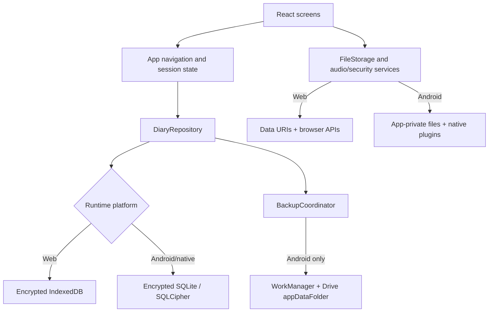
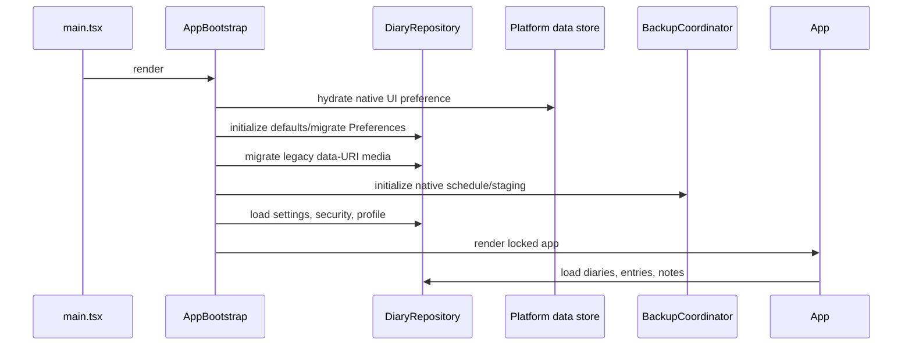
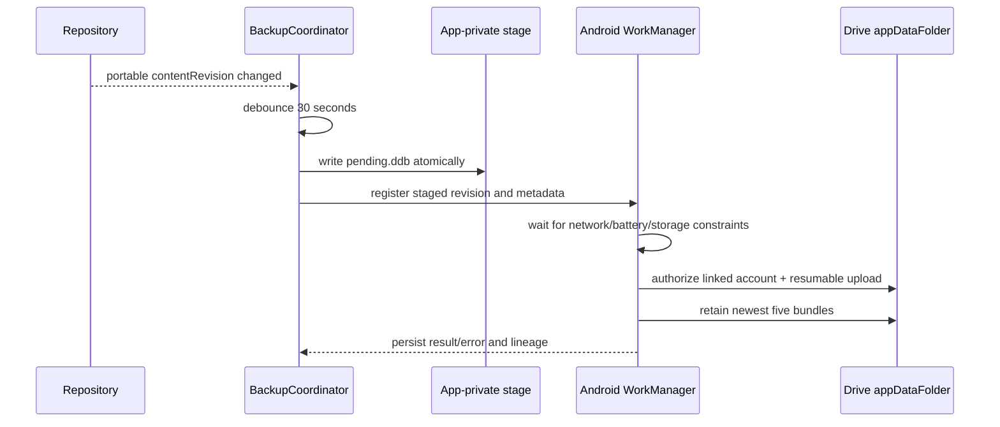

# Dear Diary

Dear Diary is a private, local-first journaling application for the web and Android. It supports multiple journals, rich diary entries, quick notes, photos, voice notes, search, personal analytics, app/diary locks, portable backups, and optional end-to-end encrypted multi-device sync.

The device remains the source of truth for journal content. Optional encrypted sync stores metadata in Supabase and encrypted objects in the user's Google Drive appDataFolder; the service never receives plaintext journal entries or notes.

## Contents

- [What the app does](#what-the-app-does)
- [Functional flows](#functional-flows)
- [Architecture](#architecture)
- [Storage and data model](#storage-and-data-model)
- [Security and privacy model](#security-and-privacy-model)
- [Backup and restore](#backup-and-restore)
- [Local development](#local-development)
- [Android development](#android-development)
- [iOS status](#ios-status)
- [Environment variables](#environment-variables)
- [Testing and validation](#testing-and-validation)
- [Project structure](#project-structure)
- [Known limitations and operational notes](#known-limitations-and-operational-notes)

## What the app does

### Journals and entries

- Creates multiple diaries with a name, emoji, color, optional cover image, up to four decorative foil icons, and an optional diary lock.
- Shows diaries in compact-grid or list layouts and remembers that view preference.
- Edits diary appearance and lock state; deleting a diary also deletes all entries assigned to it.
- Creates, edits, and deletes dated entries.
- Supports entry title, date, time, rich text, mood, tags, multiple photos, and voice recordings.
- Stores an entry as ordered time-stamped blocks (called “moments” in the UI). Existing single-body entries are migrated into a first block when edited.
- Provides formatting controls for bold, italic, underline, strike-through, heading, quotation, list, and font family.
- Includes a distraction-reduced focus mode.
- Provides a privacy-first **Local Reflection** tool that suggests a mood, tags, and an empathetic response using on-device keyword heuristics. No journal text is sent to an AI service.
- Supports speech-to-text and audio notes when the platform provides the required microphone and speech services.

### Reading and exporting a diary

- Displays the newest entry first and supports previous/next page navigation and left/right swipe gestures.
- Searches within the current diary by title, body, tag, or mood.
- Opens entries through a calendar or table of contents; selecting an empty calendar day starts the entry editor.
- Displays photos in a lightbox and plays the entry's primary or block-level audio.
- Exports one diary as plain text or JSON.
- Opens a print compilation suitable for the browser/system “Save as PDF” flow.

The per-diary JSON export is a readable data extract. It is not the same format as the full password-protected app backup and has no matching import screen.

### Quick notes

- Captures a note with one tag and derives its initial title from the first 30 characters.
- Edits note title and rich-text body, pin state, and multiple tags.
- Filters notes by all, pinned, tagged, or untagged; pinned notes sort first.
- Converts a note into an entry in the first diary, using the `Reflective` mood.

### Home dashboard

- Shows a time-sensitive greeting, profile, date, daily word goal, and current writing streak.
- Cycles through built-in writing prompts and opens the entry editor with the selected prompt inserted as a quotation.
- Shows up to four recently active diaries and the most frequently used tags.
- Saves a lightweight “Quick Jot” directly to notes.

### Search

- Searches diary entries and notes in real time by title or body.
- Filters by source, built-in and custom tags, inclusive date range, and whether an entry has photos.
- Requires all selected tags to match and sorts results newest first.
- Excludes entries belonging to a locked diary until that diary is unlocked for the current app session.
- Opens note results in the note editor and entry results in their containing diary.

### Reflections and statistics

- Shows streak, entry count, and attached photo count.
- Calculates mood distribution and frequent mood/tag pairings.
- Provides year/month “year in pixels” mood calendars with links to existing memories or a new entry for an empty day.
- Shows a 30-day writing-frequency heatmap using entries and notes.
- Ranks the five most-used tags and shows the eight most recent photo memories.
- Keeps locked-diary entries out of analytics until that diary is unlocked for the session.

### Profile and settings

The settings area has four tabs:

| Tab | Capabilities |
| --- | --- |
| Profile | Link/reconnect/disconnect Google on native mobile; edit nickname, email, bio, avatar, color, and daily word target. |
| Security | Change a 4- or 8-digit PIN, replace the recovery question, inspect Google recovery status, and enable/disable native biometrics or a web passkey. |
| Backup | Inspect Drive backup status, run a backup, set automatic backup policy, resolve device ownership conflicts, and export/import a password-protected local backup. |
| Customize | Configure the Android daily reminder, switch light/dark theme, and manage custom tags and moods. |

## Functional flows

### First launch

1. The bootstrap layer opens local storage, initializes default records, migrates legacy native media if necessary, and starts the native backup coordinator.
2. The lock screen asks for either a 4-digit or 8-digit PIN and confirmation.
3. A recovery question is mandatory. The user can choose a preset question or write a custom one.
4. The user can then:
   - stay local, or
   - link a Google account on native mobile for Drive backup and Google-based PIN recovery.
5. If the linked account already contains a hidden backup, the user can replace local portable content, safely merge while preserving conflicts as recovered copies, or continue locally. Continuing locally blocks cloud writes so the existing cloud backup is not overwritten accidentally.
6. After setup, the app reloads repository state and opens Home.

Older installations that already have a PIN but no recovery question must add one after their next successful PIN verification.

### Normal unlock and relock

1. Every application mount starts at the lock screen; the persisted `isLocked` flag is not trusted as an authenticated session.
2. The ambient lock view shows the clock and rotating text; tapping through opens the keypad.
3. A correct PIN or enabled biometric/passkey starts an in-memory authenticated session.
4. The navigation-bar lock button ends the session and forgets every per-diary unlock.
5. On Android, the system Back button unwinds focus mode and nested screens, returns to Home, and exits the app only when already at Home.

There is currently no inactivity timer or app-background auto-lock hook. Startup and the explicit lock action are the implemented app-lock boundaries.

### Forgotten PIN

1. Choose the recovery path from the lock screen.
2. Verify either the local recovery answer or the exact Google account already bound to the device.
3. Choose and confirm a new 4- or 8-digit PIN.
4. Resetting the PIN disables biometrics/passkeys; they can be enrolled again in Settings.

### Locked diary

1. Opening a locked diary shows a diary-level challenge.
2. The same app PIN or enabled biometric/passkey unlocks it for the current authenticated session.
3. Until then, its entries are omitted from Home metrics, Search, and Stats.
4. Relocking the app clears the set of unlocked diary IDs.

The diary lock is an application access-control feature. It does not create a separate PIN or a separately encrypted database per diary.

### Create and update an entry

1. Start from a diary, an empty calendar day, a Home writing prompt, or an empty Stats calendar day.
2. Choose the destination diary when the flow originated from a Home prompt.
3. Enter title/date, select a mood and tags, attach photos, and write formatted content.
4. Optionally record an audio moment or dictate text.
5. Saving filters empty blocks, appends the current draft as a time-stamped block, sorts blocks by time, and combines their HTML into the entry's searchable/display body.
6. The repository recalculates word/photo counts, the diary's entry count and “last updated” label, and the portable content revision.
7. On Android, a changed content revision schedules a debounced backup-stage refresh if Drive is linked and cloud writes are allowed.

### Voice and dictation behavior

| Platform/mode | Behavior |
| --- | --- |
| Web audio note | Uses `MediaRecorder` without starting speech recognition; the audio remains a data URI in browser storage. |
| Web speech-to-text | Uses browser `SpeechRecognition`/`webkitSpeechRecognition` without recording audio when available. Browser implementations may require network access. |
| Android audio note | Uses the native voice-recorder plugin and writes the result to app-private files. |
| Android speech-to-text | Uses Android speech recognition and inserts recognized text; it does not start the native audio recorder. |

Audio Note and Dictate Text are separate on every platform so microphone services do not compete and the UI never promises an unavailable transcription fallback. Dictation uses the device/browser language with `en-US` fallback. Android requires an installed and enabled speech-recognition service.

### Full manual export/import

1. Open Settings → Backup → Advanced Local Export.
2. Enter a password of at least 12 characters to export a media-complete `.ddbackup` archive protected with authenticated AES-256-GCM encryption.
3. To restore, select that `.ddbackup` file and enter the same password. Legacy CryptoJS `.txt` backups remain importable.
4. After successful import, the page reloads.

The file contains diaries, entries, notes, media, app settings, and profile. It deliberately does not contain the app PIN, recovery hashes, biometric credential state, Google tokens, Drive runtime state, or the native SQLite encryption secret.

## Architecture

### Runtime overview



### Startup sequence



`AppBootstrap` caches its initialization promise so React Strict Mode does not run native initialization twice. A storage error produces a retry screen instead of rendering the journal against partial state.

### Navigation model

The app does not use React Router. `App.tsx` owns an in-memory navigation state:

- Main tabs: `home`, `diaries`, `notes`, `search`, and `stats`.
- Nested screens: diary detail, diary settings, entry editor, and app settings.
- Selected diary, entry, date, note, and writing prompt IDs are passed as state.
- Refreshing the browser restarts at the lock screen and Home after unlock; there are no URL-deep-link routes.

### Repository and writes

All domain writes pass through the async `DiaryRepository`. Writes are serialized with a promise tail to avoid lost updates from overlapping UI actions. A portable write also increments `contentRevision` and notifies backup listeners. Security-only and Drive-runtime writes do not increment the portable content revision.

Multi-record native writes use a SQLite transaction. For example, saving an entry updates the entries collection, normalized entry/block/media tables, diary statistics, compatibility record, and Drive revision atomically.

### Development server

`server.ts` is intentionally small:

- In development, Express mounts Vite in middleware mode on `0.0.0.0:3000`.
- In production mode, it serves the built `dist` directory with SPA fallback.
- `GET /api/health` returns `{ "status": "ok", "offline": true }`.
- There are no journal CRUD, authentication, AI, or backup APIs on the server.

## Storage and data model

### Platform storage matrix

| Concern | Web | Android/native |
| --- | --- | --- |
| Journal/settings/security records | Encrypted IndexedDB with legacy `localStorage` read-migration | Encrypted SQLite with normalized tables and a compatibility key/value record |
| Photos, covers, audio | Data URIs stored with the record | Files under Capacitor `Directory.Data`; database records store converted file URIs |
| SQLite encryption secret | Not applicable | Random 32-byte value in OS-backed Capacitor Secure Storage |
| Legacy Preferences migration | Not applicable | Preferences are read only as a migration source after encrypted SQLite opens |
| Backup staging | Not available | Atomic app-private `backups/pending.ddb` file |
| UI-only diary layout | `localStorage` | Mirrored through Preferences, then hydrated into `localStorage` for the UI |

Native SQLite uses database name `dear_diary_local`, schema version `1`, and SQLCipher encryption. Its normalized tables are:

- `diaries`
- `entries`
- `entry_blocks`
- `notes`
- `media_assets`
- `app_settings`
- `user_profile`
- `storage_meta`
- `kv_store` for migration/format compatibility

On the first native launch after upgrading from Preferences, the app opens encrypted SQLite, copies known legacy keys, populates normalized tables, verifies source and target collection counts, and only then records migration completion. Runtime native writes fail closed if encrypted SQLite cannot be opened; Preferences are not used as a fallback storage backend.

Legacy native cover/photo/audio data URIs are migrated to app-private files on startup. Incomplete migrations are retried on the next launch.

### Core entities

| Entity | Important fields |
| --- | --- |
| `Diary` | ID, name, emoji, color, locked flag, cover URI, foil icons, derived entry count/last-updated label |
| `Entry` | Diary ID, date/time, title, combined HTML body, mood, tags, photo URIs/count, word count, audio, ordered blocks, timestamps |
| `EntryBlock` | ID, time, HTML body, optional audio URI |
| `Note` | ID, title, rich-text body, pinned flag, tags, timestamps |
| `AppSettings` | Theme, reminder preference/time, custom tags, custom moods |
| `UserProfile` | Name, email, bio, avatar, writing target, joined date |
| `SecurityConfig` | PIN/recovery hashes and salts, biometric/passkey flags, linked Google recovery identity |
| `DriveBackupState` | Account identity, schedule, revisions, lineage, last result/error, and cloud-write block state |

A fresh data store creates one unlocked diary named **My Diary** and no entries or notes.

## Security and privacy model

### PIN and recovery

- PINs are restricted to exactly 4 or 8 numeric digits.
- The PIN is stored as `SHA-256(PIN + random salt)`, not in plaintext.
- Recovery answers are trimmed, whitespace-normalized, lowercased, salted, and hashed with PBKDF2 using 120,000 iterations.
- The Google user ID is pinned to the first linked recovery account to prevent a different Google account from silently taking over reset access.
- OAuth access tokens are memory-only and are reacquired before Drive operations.

### Biometrics and passkeys

- Android requires an enrolled strong biometric and uses the native biometric plugin. The app PIN remains the fallback.
- Web uses WebAuthn and therefore normally requires HTTPS or localhost, a supported authenticator, and direct top-level browser access.
- A simulated passkey is offered only as a preview fallback when a framed or restricted web environment blocks WebAuthn. It must not be treated as production security.

### At-rest protection boundaries

- Android journal records are protected by SQLCipher and the database secret is kept in OS-backed secure storage.
- Android media lives in app-private storage but is not separately encrypted by application code.
- Web journal data and media are stored in encrypted IndexedDB. This protects against casual local disk inspection, but it is still a same-origin browser storage boundary and does not protect against malicious JavaScript running in the app origin.
- Drive `appDataFolder` hides backups from the normal Drive UI and limits access to the app. Optional end-to-end encryption adds a separate passphrase boundary; Drive timestamps, size, and lineage metadata remain visible to Google.
- New manual exports use authenticated AES-256-GCM envelopes. Losing the passphrase makes that archive unrecoverable.

Clearing browser site data or Android app storage deletes local data and security material. Android's ordinary app uninstall/clear-storage recovery therefore depends on an existing Drive or manual backup.

## Backup and restore

### Google Drive scope and availability

Google Drive integration is Android/native-only and uses:

```text
https://www.googleapis.com/auth/drive.appdata
```

Backups are ZIP bundles with MIME type `application/vnd.deardiary.backup+zip`, stored in the hidden Drive `appDataFolder`. The app retains the five newest successful backups.

### Bundle format

```text
deardiary-backup-<timestamp>.ddb
├── manifest.json   # schema/app/storage version, counts, size, SHA-256 checksum, lineage
├── data.json       # portable diaries, entries, notes, settings, profile, media references
└── media/
    ├── cover-...
    ├── photo-...
    └── audio-...
```

Current bundle schema is `2`; payload version is `3.0.0`. Restore validation also accepts the legacy schema-1 / payload-2 format. The checksum covers `data.json`, media paths, and media bytes and rejects missing, unsupported, or corrupted bundles.

### Automatic backup flow



- Schedule choices are Off, Daily, or Weekly at a preferred local time.
- Network choices are Wi-Fi only or Wi-Fi plus cellular.
- WorkManager also requires battery and storage not low, retries transient errors with exponential backoff, and may run later than the requested time because of Doze or unmet constraints.
- Boot, app update, clock, and timezone broadcasts reschedule pending automatic work.
- Manual “Back up now” stages the latest revision and asks WorkManager to run immediately, but Android constraints still apply.
- Optional Drive encryption uses a random master key protected by a user passphrase. The master key is cached in Android secure storage for background work; the passphrase is never stored.

### Backup restore and sync safety

Drive backup bundles remain snapshot-based. Encrypted multi-device sync is a separate event/snapshot stream described in [docs/sync-and-supabase.md](docs/sync-and-supabase.md). A backup bundle can be applied in two explicit modes:

- **Replace** swaps portable content after creating a safety snapshot.
- **Safe Merge** retains local content, imports cloud-only records, and preserves divergent records as recovered copies. Snapshot deletions are never propagated.

Replacement restore works as follows:

1. The app lists the newest five hidden backups and tries them newest-first until a compatible bundle validates.
2. Before replacement, it attempts to save a local `pre-restore-<timestamp>.ddb` safety snapshot.
3. Media is recreated in the target device's app-private storage.
4. The repository performs a portable replacement transaction.
5. Diaries, entries, notes, profile, theme, custom tags/moods, and the portable backup schedule are restored.
6. The target device keeps its PIN, recovery question, biometric state, reminder preference, Google account binding, permissions, SQLite secret, and device identity.
7. The restored backup becomes the new lineage parent and the app stages a post-restore checkpoint.

Each backup records `deviceId`, `contentRevision`, and `parentBackupFileId`. If a different device has advanced the latest cloud lineage, automatic upload blocks rather than overwriting it. The user must restore that backup or explicitly choose **Use this device for backup**, which confirms replacement without merging.

Per-diary portability is provided through password-protected `.ddiary` archives containing a manifest, readable text, structured diary JSON, and all referenced cover/photo/audio files. Import always creates a new diary with remapped IDs.

## Local development

### Prerequisites

- Node.js and npm compatible with the checked-in lockfile and Vite 6.
- A modern browser. Chromium-based browsers provide the broadest speech-recognition/WebAuthn support.
- For microphone and WebAuthn features outside localhost, serve the app over HTTPS.

### Install and run

Use the lockfile for a reproducible install:

```bash
npm ci
npm run dev
```

Open `http://localhost:3000`.

Useful commands:

| Command | Purpose |
| --- | --- |
| `npm run dev` | Start Express with Vite middleware on port 3000. |
| `npm run lint` | Run TypeScript type-checking (`tsc --noEmit`). |
| `npm run test:storage` | Run repository, security, and backup validation tests. |
| `npm run build` | Build the Vite client and bundle `server.ts` to `dist/server.cjs`. |
| `npm run preview` | Preview the built Vite client with Vite's preview server. |
| `npm run start` | Start `dist/server.cjs`; set `NODE_ENV=production` to serve static production assets. |

Production start examples:

```powershell
$env:NODE_ENV='production'
npm run start
```

```bash
NODE_ENV=production npm run start
```

## Android development

### Prerequisites

- Android Studio and Android SDK 36.
- A JDK compatible with Android Gradle Plugin 8.13 / Gradle 8.14.3.
- An emulator or physical device running Android 7.0 (API 24) or newer.

The Android project already exists; do not run `cap add android` for a normal checkout.

### Build and run

```bash
npm ci
npm run mobile:sync
npm run android:studio
```

Or run directly on a connected target:

```bash
npm run android
```

`mobile:sync` builds the web/server bundle and runs `cap sync`, copying the web assets and updating native plugins. After any web, dependency, Capacitor configuration, or environment-variable change, run it again.

To create a debug APK from PowerShell:

```powershell
npm run mobile:sync
Set-Location android
.\gradlew.bat assembleDebug
```

The APK is written under `android/app/build/outputs/apk/debug/`.

Capacitor WebView logging and inspection are disabled by default. For a local debug sync:

```powershell
$env:CAPACITOR_WEBVIEW_DEBUG='true'
npm run mobile:sync
```

Do not enable this in a production build.

### Release assets and signing

Regenerate the adaptive launcher icons and light/dark splash set from `resources/icon.png` and `resources/splash.png`:

```bash
npm run assets:generate
```

Release version/signing values can be supplied through Gradle/environment properties. Copy `android/keystore.properties.example` to the ignored `android/keystore.properties`, then replace its placeholders. Keystores and passwords must remain outside version control.

```powershell
npm run android:lint
npm run android:test
npm run android:release
npm run android:bundle
```

`android:release` can validate an unsigned release build. `android:bundle` produces a signed upload bundle only when all four `DEAR_DIARY_STORE_*` values are configured. Release minification is intentionally disabled for the first public build.

### Google Cloud setup for Drive backup

1. Enable **Google Drive API** in the Google Cloud project.
2. Configure the OAuth consent screen and add development accounts as test users while the app is unpublished.
3. Create an Android OAuth client for package `com.deardiary.app` and add the SHA-1 for every debug/release signing certificate.
4. Create a Web application OAuth client in the same project.
5. Put that Web client ID in `.env` as `VITE_GOOGLE_WEB_CLIENT_ID`.
6. Rebuild, sync, and reinstall the app.

Get the debug signing fingerprint with:

```powershell
Set-Location android
.\gradlew.bat signingReport
```

The current Drive authorization path does not rely on Firestore. `firestore.rules`, `firebase-blueprint.json`, and `firebase-applet-config.json` are legacy project artifacts; the application does not import the Firebase SDK or read/write Firestore.

### Android permissions

| Permission | Use |
| --- | --- |
| Internet/network state | Google authorization and Drive backup constraints |
| Record audio | Audio notes and speech recognition |
| Camera / image access | Image attachment chooser/capture support |
| Post notifications | Local journal reminder implementation |
| Use biometric | Fingerprint/strong biometric unlock |
| Receive boot completed | Reschedule Drive backup after reboot/update/time changes |

## iOS status

Capacitor iOS dependencies and npm scripts are present, but this repository does not contain an `ios/` native project. Generate it on macOS:

```bash
npm run cap:add:ios
npm run mobile:sync
npx cap open ios
```

The storage/media abstractions are written for Capacitor native platforms, but the custom Drive authorization and background worker are Android Java implementations. Google Drive background backup is therefore not implemented for iOS; use the password-protected manual export/import flow until an iOS bridge and scheduler are added.

## Environment variables

Copy `.env.example` to `.env` when native Google backup is required. Vite exposes only variables prefixed with `VITE_` to client code.

| Variable | Required | Used by |
| --- | --- | --- |
| `VITE_GOOGLE_WEB_CLIENT_ID` | Android Drive/Google recovery only | Native Google Sign-In initialization; must be the OAuth **Web application** client ID. |
| `VITE_SUPABASE_URL` | Encrypted multi-device sync | Supabase project URL for the sync metadata control plane. Apply `docs/supabase/001` through `docs/supabase/014` in order before enabling sync. See [docs/sync-and-supabase.md](docs/sync-and-supabase.md). |
| `VITE_SUPABASE_ANON_KEY` | Encrypted multi-device sync | Supabase anon key for the sync metadata control plane. |
| `VITE_ENABLE_MD_FLOW_HOOKS` | Manual MD-021/MD-022 force-stop test builds only | Enables one-shot localStorage checkpoints documented in [SEEDED_DEVICE_STATE_MD021_MD022.md](docs/testing/SEEDED_DEVICE_STATE_MD021_MD022.md). Never enable in release builds. |
| `VITE_APP_VERSION` | Optional | Version recorded in Drive backup manifests; defaults to `0.0.0`. |
| `CAPACITOR_WEBVIEW_DEBUG` | Optional build-time setting | Enables Android WebView inspection when exactly `true`. Use this for manual device testing. |
| `CAPACITOR_BRIDGE_LOGGING` | Optional build-time setting | Enables verbose Capacitor bridge logging when exactly `true`. Do not use for sync/recovery tests because native plugin payloads can include sensitive values. |
| `CAPACITOR_DEBUG` | Optional legacy build-time setting | Also enables Android WebView inspection when exactly `true`; prefer `CAPACITOR_WEBVIEW_DEBUG`. |
| `DISABLE_HMR` | Optional development setting | Disables Vite HMR/file watching when exactly `true`. |
| `NODE_ENV` | Production server only | Must be `production` for `dist/server.cjs` to serve static assets instead of creating Vite middleware. |

The reflection assistant is local and requires no API key. AI Studio/Gemini placeholders and the unused Gemini client dependency have been removed.

Never commit `.env`; the repository ignores all `.env*` files except `.env.example`.

## Testing and validation

Run the normal validation suite:

```bash
npm run lint
npm run test:storage
npm run build
```

The automated tests cover:

- entry creation, diary-stat updates, and cascading diary deletion;
- serialized concurrent repository writes;
- full and portable snapshot replacement behavior;
- preservation of local security, reminders, and device backup identity during portable restore;
- portable content-revision notifications;
- PIN creation/change/recovery and Google account binding;
- rejection of incomplete, unsupported, or checksum-invalid Drive bundles;
- compatibility validation for legacy schema-1 and current portable schema-2 bundles.
- authenticated backup encryption, wrong-passphrase, and tamper rejection;
- safe-merge additions, skips, diary cloning, recovered conflicts, and catalog unions;
- reference-aware native media garbage-collection selection.

There are no component/end-to-end tests or Android instrumentation tests for app behavior beyond the generated sample test stubs. Physical-device QA remains essential for permissions, biometrics, microphone behavior, Preferences/legacy-media migrations, WorkManager scheduling, authorization revocation, resumable uploads, and multi-device lineage conflicts.

## Project structure

```text
.
├── src/
│   ├── AppBootstrap.tsx          # storage/migration/backup startup gate
│   ├── App.tsx                   # auth session, navigation, screen composition
│   ├── components/               # lock, home, diary, editor, notes, search, stats, settings
│   ├── domain/                   # security, catalog, streak, settings, storage calculations
│   ├── repositories/             # async domain repository and defaults
│   ├── platform/
│   │   ├── storage/              # encrypted IndexedDB, Preferences migration, encrypted SQLite
│   │   ├── filesystem/           # web/native file storage
│   │   ├── audio/                # recording capability abstraction
│   │   ├── security/             # WebAuthn/native biometric abstraction
│   │   └── drive/                # TypeScript bridge for the Android Drive plugin
│   ├── mobile/                   # Capacitor startup, reminders, media persistence/migration
│   └── utils/                    # backup bundles, Drive, Google auth, manual backup, WebAuthn
├── android/                      # Android Studio project and custom Drive/WorkManager Java code
├── docs/mobile-capacitor.md      # native implementation notes and release checklist
├── docs/sync-and-supabase.md     # encrypted sync and Supabase migration runbook
├── capacitor.config.ts           # app ID, native debug policy, SQLite encryption config
├── server.ts                     # Express/Vite development and static production server
├── vite.config.ts                # React, Tailwind, alias, HMR configuration
└── package.json                  # scripts and dependencies
```

Important entry points:

- `src/main.tsx` renders React and starts Capacitor bootstrap behavior.
- `src/AppBootstrap.tsx` prevents the UI from opening before local state is usable.
- `src/repositories/localDiaryRepository.ts` is the source of application CRUD and snapshot semantics.
- `src/platform/storage/nativeSQLiteDataStore.ts` owns native encryption, schema, and Preferences migration.
- `src/utils/backupSnapshot.ts` defines the portable Drive bundle and restore boundary.
- `src/utils/backupCoordinator.ts` stages native backups after content changes.
- `android/app/src/main/java/com/deardiary/app/DriveBackupWorker.java` enforces Android backup constraints, retries, retention, and lineage safety.

## Known limitations and operational notes

- Android is the complete native target. iOS lacks the custom Drive bridge/background scheduler.
- Web data is local to one browser profile and protected by browser-origin encrypted storage, not a hardware-backed secret store.
- Scheduled Drive backup remains snapshot-based. Multi-device sync is a separate encrypted event stream. Backup Safe Merge preserves divergent records but cannot propagate deletions because backup snapshots do not contain tombstones.
- End-to-end encryption is optional. Unencrypted legacy/current backups remain Google-protected, and encrypted-backup metadata such as size, timestamps, and lineage remains visible.
- Browser speech-recognition availability and network behavior still vary by browser. Android Dictate Text requires installed Android speech services.
- Media cleanup is eventual for ordinary edits: newly created unreferenced files receive a 24-hour grace period to protect unsaved drafts.
- Android **Settings → Apps → Dear Diary → Clear storage** remains destructive. OS backup/device transfer is disabled to prevent partial encrypted-data restoration; recovery requires Drive or a `.ddbackup` archive.
- Before a store release, complete large-library/interrupted/low-storage migration tests, production-signed Drive and two-device tests, icon/splash verification on physical devices, signing configuration, and release build documentation. See [docs/mobile-capacitor.md](docs/mobile-capacitor.md).
